# Alibre Design on Github

Snapshot UTC: 2026-09-06 23:05:24Z

  - Methodology: Data is collected via GitHub REST API repository search and releases endpoints using fixed search terms and deterministic grouping rules.
  - Scope: Results reflect publicly accessible GitHub data at the snapshot time; private repos and inaccessible resources are excluded.
  - Search Constraints: Repository discovery uses term matching against repository metadata and is subject to GitHub search indexing behavior and API limits.
  - Language Filter: Analysis includes only repositories whose primary language is C#, Python, IronPython, HTML, Visual Basic (.NET/VB variants), or C++ (including close variants).
  - Release Coverage: Release summaries include only repositories with at least one GitHub Release; repositories without releases are excluded from release-only tables.
  - Attribution: Download counts are sourced from GitHub release asset download metrics and may change over time.
  - Quality Note: Term matches indicate probable relevance, not guaranteed topical correctness; flagged repositories may be false positives.
  - Snapshot Disclaimer: Metrics are point-in-time and reproducible only for the same query terms, filters, and API state at collection time.
  - Non-Endorsement: Inclusion in this report does not imply endorsement, affiliation, or validation by Alibre LLC or repository owners.
  - Use Limitation: This report is for research/operational insight and should not be used as sole evidence for legal, licensing, or compliance decisions.

# By Project

## All Repos Matched (Full Detail)

| Project | Owner | Language | Stars | Forks | Matched Terms | Relevance Note |
| --- | --- | --- | --- | --- | --- | --- |
| [bolsover/UtilitiesForAlibre](https://github.com/bolsover/UtilitiesForAlibre) | bolsover | C# | 10 | 3 | alibre |  |
| [AlibreDesignCommunityProjects/alibre-stltostp-addon](https://github.com/AlibreDesignCommunityProjects/alibre-stltostp-addon) | AlibreDesignCommunityProjects | C# | 2 | 1 | "alibre design" \| alibre |  |
| [AlibreDesignCommunityProjects/AlibreScript](https://github.com/AlibreDesignCommunityProjects/AlibreScript) | AlibreDesignCommunityProjects | Python | 2 | 1 | "alibre script" \| alibre \| alibrescript |  |
| [bolsover/AlibreBOM](https://github.com/bolsover/AlibreBOM) | bolsover | C# | 2 | 0 | alibre |  |
| [bolsover/AlibreExportOpen](https://github.com/bolsover/AlibreExportOpen) | bolsover | C# | 2 | 1 | alibre |  |
| [bolsover/AlibreShortcuts](https://github.com/bolsover/AlibreShortcuts) | bolsover | C# | 2 | 1 | alibre |  |
| [bolsover/DataBrowserForAlibre](https://github.com/bolsover/DataBrowserForAlibre) | bolsover | C# | 2 | 1 | alibre |  |
| [k4kfh/alibre-neutralizer](https://github.com/k4kfh/alibre-neutralizer) | k4kfh | Python | 2 | 2 | "alibre design" \| alibre |  |
| [Karl690/AlibrePartInjector](https://github.com/Karl690/AlibrePartInjector) | Karl690 | C# | 1 | 0 | alibre |  |
| [AlibreDesignCommunityProjects/Alibre-Color-Studio-Experiment](https://github.com/AlibreDesignCommunityProjects/Alibre-Color-Studio-Experiment) | AlibreDesignCommunityProjects | Python | 0 | 0 | alibre |  |
| [AlibreDesignCommunityProjects/alibre-cpp-addon-template-2](https://github.com/AlibreDesignCommunityProjects/alibre-cpp-addon-template-2) | AlibreDesignCommunityProjects | C++ | 0 | 1 | alibre |  |
| [AlibreDesignCommunityProjects/alibre-cross-section-tools-addon](https://github.com/AlibreDesignCommunityProjects/alibre-cross-section-tools-addon) | AlibreDesignCommunityProjects | Python | 0 | 1 | alibre |  |
| [AlibreDesignCommunityProjects/alibre-design-explorer-refresh-tool](https://github.com/AlibreDesignCommunityProjects/alibre-design-explorer-refresh-tool) | AlibreDesignCommunityProjects | Visual Basic .NET | 0 | 1 | "alibre design" \| alibre |  |
| [AlibreDesignCommunityProjects/alibre-fillet-r-and-d-app](https://github.com/AlibreDesignCommunityProjects/alibre-fillet-r-and-d-app) | AlibreDesignCommunityProjects | Visual Basic .NET | 0 | 1 | alibre |  |
| [AlibreDesignCommunityProjects/alibre-HOOPS-addon](https://github.com/AlibreDesignCommunityProjects/alibre-HOOPS-addon) | AlibreDesignCommunityProjects | C# | 0 | 1 | alibre |  |
| [AlibreDesignCommunityProjects/alibre-logos](https://github.com/AlibreDesignCommunityProjects/alibre-logos) | AlibreDesignCommunityProjects | HTML | 0 | 0 | alibre |  |
| [AlibreDesignCommunityProjects/alibre-py-gear-addon](https://github.com/AlibreDesignCommunityProjects/alibre-py-gear-addon) | AlibreDesignCommunityProjects | Python | 0 | 1 | "alibre design" \| alibre |  |
| [AlibreDesignCommunityProjects/alibre-python-shell-addon-v2](https://github.com/AlibreDesignCommunityProjects/alibre-python-shell-addon-v2) | AlibreDesignCommunityProjects | C# | 0 | 1 | "alibre design" \| alibre |  |
| [AlibreDesignCommunityProjects/alibre-script-examples](https://github.com/AlibreDesignCommunityProjects/alibre-script-examples) | AlibreDesignCommunityProjects | Python | 0 | 0 | alibre |  |
| [AlibreDesignCommunityProjects/alibre-script-library-examples](https://github.com/AlibreDesignCommunityProjects/alibre-script-library-examples) | AlibreDesignCommunityProjects | Python | 0 | 1 | alibre |  |
| [AlibreDesignCommunityProjects/alibre-script-runner](https://github.com/AlibreDesignCommunityProjects/alibre-script-runner) | AlibreDesignCommunityProjects | Python | 0 | 1 | "alibre script" \| alibre |  |
| [AlibreDesignCommunityProjects/alibre-shapes-addon](https://github.com/AlibreDesignCommunityProjects/alibre-shapes-addon) | AlibreDesignCommunityProjects | C# | 0 | 1 | "alibre script" \| alibre |  |
| [AlibreDesignCommunityProjects/alibre-sweep-tools-addon](https://github.com/AlibreDesignCommunityProjects/alibre-sweep-tools-addon) | AlibreDesignCommunityProjects | Python | 0 | 2 | alibre |  |
| [AlibreDesignCommunityProjects/alibrex_package](https://github.com/AlibreDesignCommunityProjects/alibrex_package) | AlibreDesignCommunityProjects | Python | 0 | 1 | "alibre design" \| "alibrex api" \| alibre \| alibrex |  |
| [AlibreDesignCommunityProjects/GetInstalledAddons.Tool](https://github.com/AlibreDesignCommunityProjects/GetInstalledAddons.Tool) | AlibreDesignCommunityProjects | Visual Basic .NET | 0 | 1 | "alibre design" \| alibre |  |
| [AlibreDesignCommunityProjects/MeasureLengths](https://github.com/AlibreDesignCommunityProjects/MeasureLengths) | AlibreDesignCommunityProjects | C++ | 0 | 1 | "alibre design" \| alibre |  |
| [bolsover/AlibreImportStlAsStep](https://github.com/bolsover/AlibreImportStlAsStep) | bolsover | C# | 0 | 1 | alibre |  |
| [EdGames05/ALibrerias](https://github.com/EdGames05/ALibrerias) | EdGames05 | C++ | 0 | 0 | alibre |  |
| [ftkalcevic/AlibreGears](https://github.com/ftkalcevic/AlibreGears) | ftkalcevic | C# | 0 | 0 | alibre |  |
| [jorgesaraviaf-alt/V-alibre](https://github.com/jorgesaraviaf-alt/V-alibre) | jorgesaraviaf-alt | HTML | 0 | 0 | alibre |  |
| [LemonExplosive/AlibreCadScripts](https://github.com/LemonExplosive/AlibreCadScripts) | LemonExplosive | Python | 0 | 1 | alibre |  |
| [michaelplas/Alibrero](https://github.com/michaelplas/Alibrero) | michaelplas | Python | 0 | 0 | alibre |  |
| [mukut1994/CheckAlibreXPortableBinDirIsWorking](https://github.com/mukut1994/CheckAlibreXPortableBinDirIsWorking) | mukut1994 | C# | 0 | 0 | alibre \| alibrex |  |
| [sShauni/AlibreNB](https://github.com/sShauni/AlibreNB) | sShauni | Python | 0 | 0 | alibre |  |
| [tuffrabit/alibre-to-freecad](https://github.com/tuffrabit/alibre-to-freecad) | tuffrabit | Python | 0 | 0 | "alibre design" \| alibre |  |

## Projects

| Project | Owner | Language | Stars | Forks | Matched Terms | Releases | Total Release Downloads | Latest Release | Relevance Note |
| --- | --- | --- | --- | --- | --- | --- | --- | --- | --- |
| [bolsover/UtilitiesForAlibre](https://github.com/bolsover/UtilitiesForAlibre) | bolsover | C# | 10 | 3 | alibre | 17 | 1270 | 2025-09-24T13:32:15Z |  |
| [bolsover/AlibreShortcuts](https://github.com/bolsover/AlibreShortcuts) | bolsover | C# | 2 | 1 | alibre | 10 | 158 | 2023-11-23T14:24:56Z |  |
| [bolsover/AlibreExportOpen](https://github.com/bolsover/AlibreExportOpen) | bolsover | C# | 2 | 1 | alibre | 2 | 120 | 2022-11-08T15:01:00Z |  |
| [AlibreDesignCommunityProjects/alibre-sweep-tools-addon](https://github.com/AlibreDesignCommunityProjects/alibre-sweep-tools-addon) | AlibreDesignCommunityProjects | Python | 0 | 2 | alibre | 2 | 80 | 2025-09-01T13:34:58Z |  |
| [bolsover/AlibreImportStlAsStep](https://github.com/bolsover/AlibreImportStlAsStep) | bolsover | C# | 0 | 1 | alibre | 4 | 71 | 2025-11-06T14:37:53Z |  |
| [AlibreDesignCommunityProjects/alibre-shapes-addon](https://github.com/AlibreDesignCommunityProjects/alibre-shapes-addon) | AlibreDesignCommunityProjects | C# | 0 | 1 | "alibre script" \| alibre | 3 | 31 | 2025-07-23T20:10:40Z |  |
| [AlibreDesignCommunityProjects/MeasureLengths](https://github.com/AlibreDesignCommunityProjects/MeasureLengths) | AlibreDesignCommunityProjects | C++ | 0 | 1 | "alibre design" \| alibre | 8 | 28 | 2026-03-22T04:10:49Z |  |
| [AlibreDesignCommunityProjects/alibre-cross-section-tools-addon](https://github.com/AlibreDesignCommunityProjects/alibre-cross-section-tools-addon) | AlibreDesignCommunityProjects | Python | 0 | 1 | alibre | 2 | 10 | 2026-02-14T01:08:04Z |  |
| [AlibreDesignCommunityProjects/alibre-stltostp-addon](https://github.com/AlibreDesignCommunityProjects/alibre-stltostp-addon) | AlibreDesignCommunityProjects | C# | 2 | 1 | "alibre design" \| alibre | 0 | 0 |  |  |
| [AlibreDesignCommunityProjects/AlibreScript](https://github.com/AlibreDesignCommunityProjects/AlibreScript) | AlibreDesignCommunityProjects | Python | 2 | 1 | "alibre script" \| alibre \| alibrescript | 0 | 0 |  |  |
| [bolsover/AlibreBOM](https://github.com/bolsover/AlibreBOM) | bolsover | C# | 2 | 0 | alibre | 0 | 0 |  |  |
| [bolsover/DataBrowserForAlibre](https://github.com/bolsover/DataBrowserForAlibre) | bolsover | C# | 2 | 1 | alibre | 0 | 0 |  |  |
| [k4kfh/alibre-neutralizer](https://github.com/k4kfh/alibre-neutralizer) | k4kfh | Python | 2 | 2 | "alibre design" \| alibre | 0 | 0 |  |  |
| [Karl690/AlibrePartInjector](https://github.com/Karl690/AlibrePartInjector) | Karl690 | C# | 1 | 0 | alibre | 0 | 0 |  |  |
| [AlibreDesignCommunityProjects/Alibre-Color-Studio-Experiment](https://github.com/AlibreDesignCommunityProjects/Alibre-Color-Studio-Experiment) | AlibreDesignCommunityProjects | Python | 0 | 0 | alibre | 0 | 0 |  |  |
| [AlibreDesignCommunityProjects/alibre-cpp-addon-template-2](https://github.com/AlibreDesignCommunityProjects/alibre-cpp-addon-template-2) | AlibreDesignCommunityProjects | C++ | 0 | 1 | alibre | 0 | 0 |  |  |
| [AlibreDesignCommunityProjects/alibre-design-explorer-refresh-tool](https://github.com/AlibreDesignCommunityProjects/alibre-design-explorer-refresh-tool) | AlibreDesignCommunityProjects | Visual Basic .NET | 0 | 1 | "alibre design" \| alibre | 0 | 0 |  |  |
| [AlibreDesignCommunityProjects/alibre-fillet-r-and-d-app](https://github.com/AlibreDesignCommunityProjects/alibre-fillet-r-and-d-app) | AlibreDesignCommunityProjects | Visual Basic .NET | 0 | 1 | alibre | 0 | 0 |  |  |
| [AlibreDesignCommunityProjects/alibre-HOOPS-addon](https://github.com/AlibreDesignCommunityProjects/alibre-HOOPS-addon) | AlibreDesignCommunityProjects | C# | 0 | 1 | alibre | 0 | 0 |  |  |
| [AlibreDesignCommunityProjects/alibre-logos](https://github.com/AlibreDesignCommunityProjects/alibre-logos) | AlibreDesignCommunityProjects | HTML | 0 | 0 | alibre | 0 | 0 |  |  |
| [AlibreDesignCommunityProjects/alibre-py-gear-addon](https://github.com/AlibreDesignCommunityProjects/alibre-py-gear-addon) | AlibreDesignCommunityProjects | Python | 0 | 1 | "alibre design" \| alibre | 1 | 0 | 2026-08-19T23:45:09Z |  |
| [AlibreDesignCommunityProjects/alibre-python-shell-addon-v2](https://github.com/AlibreDesignCommunityProjects/alibre-python-shell-addon-v2) | AlibreDesignCommunityProjects | C# | 0 | 1 | "alibre design" \| alibre | 0 | 0 |  |  |
| [AlibreDesignCommunityProjects/alibre-script-examples](https://github.com/AlibreDesignCommunityProjects/alibre-script-examples) | AlibreDesignCommunityProjects | Python | 0 | 0 | alibre | 0 | 0 |  |  |
| [AlibreDesignCommunityProjects/alibre-script-library-examples](https://github.com/AlibreDesignCommunityProjects/alibre-script-library-examples) | AlibreDesignCommunityProjects | Python | 0 | 1 | alibre | 0 | 0 |  |  |
| [AlibreDesignCommunityProjects/alibre-script-runner](https://github.com/AlibreDesignCommunityProjects/alibre-script-runner) | AlibreDesignCommunityProjects | Python | 0 | 1 | "alibre script" \| alibre | 0 | 0 |  |  |
| [AlibreDesignCommunityProjects/alibrex_package](https://github.com/AlibreDesignCommunityProjects/alibrex_package) | AlibreDesignCommunityProjects | Python | 0 | 1 | "alibre design" \| "alibrex api" \| alibre \| alibrex | 0 | 0 |  |  |
| [AlibreDesignCommunityProjects/GetInstalledAddons.Tool](https://github.com/AlibreDesignCommunityProjects/GetInstalledAddons.Tool) | AlibreDesignCommunityProjects | Visual Basic .NET | 0 | 1 | "alibre design" \| alibre | 0 | 0 |  |  |
| [EdGames05/ALibrerias](https://github.com/EdGames05/ALibrerias) | EdGames05 | C++ | 0 | 0 | alibre | 0 | 0 |  |  |
| [ftkalcevic/AlibreGears](https://github.com/ftkalcevic/AlibreGears) | ftkalcevic | C# | 0 | 0 | alibre | 0 | 0 |  |  |
| [jorgesaraviaf-alt/V-alibre](https://github.com/jorgesaraviaf-alt/V-alibre) | jorgesaraviaf-alt | HTML | 0 | 0 | alibre | 0 | 0 |  |  |
| [LemonExplosive/AlibreCadScripts](https://github.com/LemonExplosive/AlibreCadScripts) | LemonExplosive | Python | 0 | 1 | alibre | 0 | 0 |  |  |
| [michaelplas/Alibrero](https://github.com/michaelplas/Alibrero) | michaelplas | Python | 0 | 0 | alibre | 0 | 0 |  |  |
| [mukut1994/CheckAlibreXPortableBinDirIsWorking](https://github.com/mukut1994/CheckAlibreXPortableBinDirIsWorking) | mukut1994 | C# | 0 | 0 | alibre \| alibrex | 0 | 0 |  |  |
| [sShauni/AlibreNB](https://github.com/sShauni/AlibreNB) | sShauni | Python | 0 | 0 | alibre | 1 | 0 | 2026-06-15T19:11:30Z |  |
| [tuffrabit/alibre-to-freecad](https://github.com/tuffrabit/alibre-to-freecad) | tuffrabit | Python | 0 | 0 | "alibre design" \| alibre | 0 | 0 |  |  |

## By User/Org

| Owner | Projects | Stars | Releases | Total Release Downloads |
| --- | --- | --- | --- | --- |
| bolsover | 6 | 18 | 33 | 1619 |
| AlibreDesignCommunityProjects | 19 | 4 | 16 | 149 |
| k4kfh | 1 | 2 | 0 | 0 |
| Karl690 | 1 | 1 | 0 | 0 |
| EdGames05 | 1 | 0 | 0 | 0 |
| ftkalcevic | 1 | 0 | 0 | 0 |
| jorgesaraviaf-alt | 1 | 0 | 0 | 0 |
| LemonExplosive | 1 | 0 | 0 | 0 |
| michaelplas | 1 | 0 | 0 | 0 |
| mukut1994 | 1 | 0 | 0 | 0 |
| sShauni | 1 | 0 | 1 | 0 |
| tuffrabit | 1 | 0 | 0 | 0 |

### Chart: By Project: Downloads by User/Org

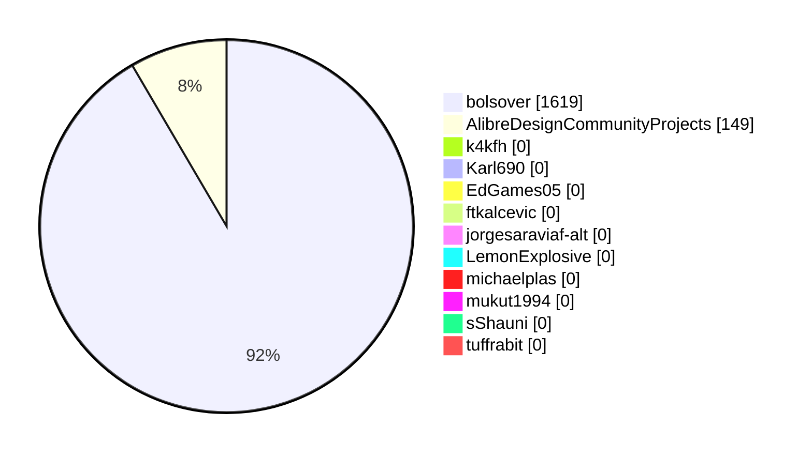

## By Language

| Language | Projects | Stars | Releases | Total Release Downloads |
| --- | --- | --- | --- | --- |
| C# | 13 | 21 | 36 | 1650 |
| Python | 14 | 4 | 6 | 90 |
| C++ | 3 | 0 | 8 | 28 |
| Visual Basic .NET | 3 | 0 | 0 | 0 |
| HTML | 2 | 0 | 0 | 0 |

### Chart: By Project: Downloads by Language

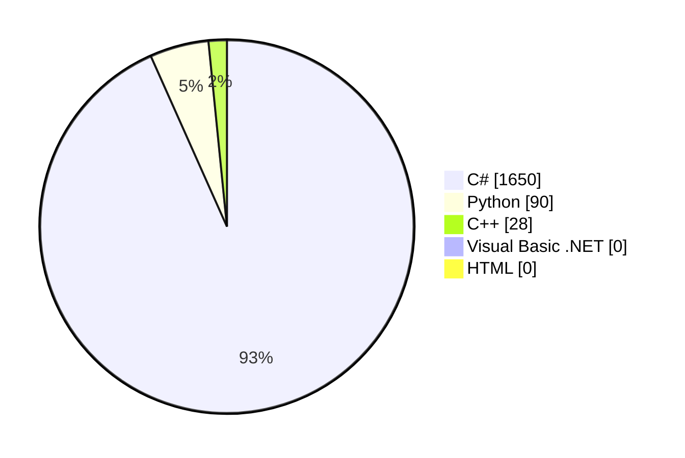

## By Search Term

| Search Term | Quick Total (No Slice) | Matched By Name/Desc | New Unique Projects | Newly Tagged Existing Projects |
| --- | --- | --- | --- | --- |
| alibre | 60 | 59 | 59 | 0 |
| "alibre design" | 15 | 14 | 0 | 14 |
| "alibre script" | 9 | 5 | 0 | 5 |
| alibrescript | 4 | 4 | 0 | 4 |
| alibrex | 3 | 3 | 0 | 3 |
| "alibrex api" | 1 | 1 | 0 | 1 |
| "alibre api" | 0 | 0 | 0 | 0 |

### Chart: By Project: Matched Projects by Search Term

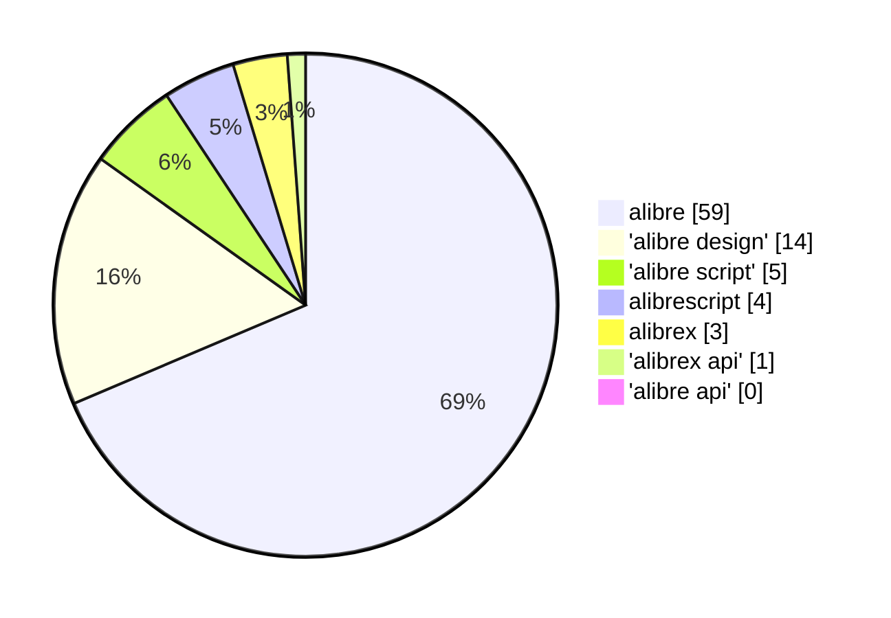

| Search Term | Projects | Stars | Releases | Total Release Downloads |
| --- | --- | --- | --- | --- |
| alibre | 35 | 25 | 50 | 1768 |
| "alibre script" | 3 | 2 | 3 | 31 |
| "alibre design" | 9 | 4 | 9 | 28 |
| alibrex | 2 | 0 | 0 | 0 |
| alibrescript | 1 | 2 | 0 | 0 |
| "alibrex api" | 1 | 0 | 0 | 0 |
| "alibre api" | 0 | 0 | 0 | 0 |

### Chart: By Project: Downloads by Search Term

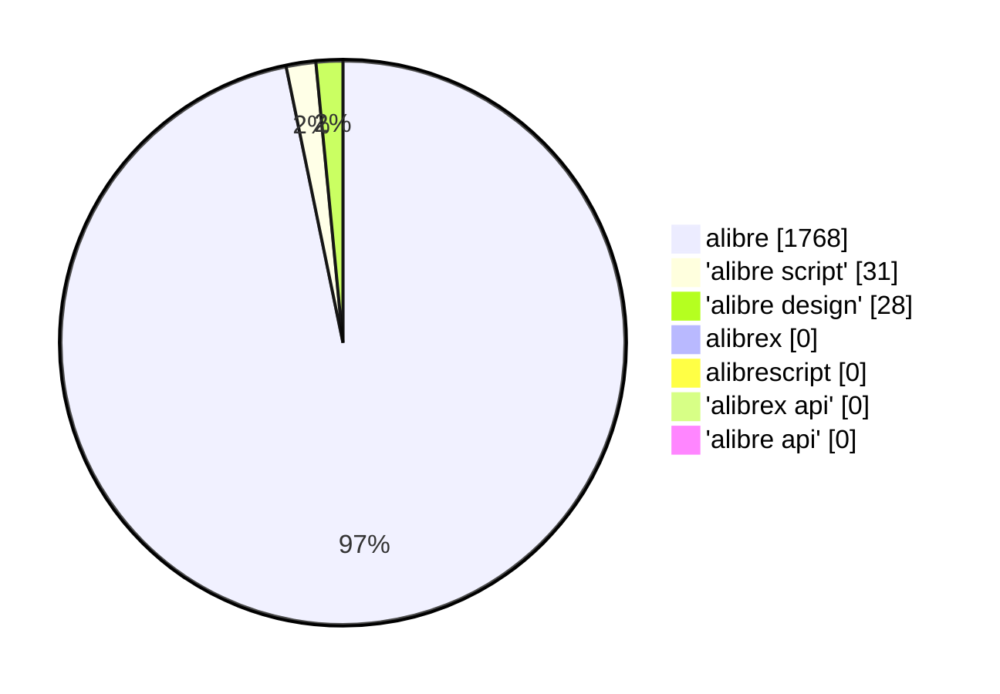

# By Project -> Release

## All Releases Matched (Full Detail)

| Project | Owner | Language | Tag | Release | Published | Draft | Prerelease | Assets | Downloads | Top Asset | Top Asset Downloads | Matched Terms | Relevance Note |
| --- | --- | --- | --- | --- | --- | --- | --- | --- | --- | --- | --- | --- | --- |
| [AlibreDesignCommunityProjects/alibre-cross-section-tools-addon](https://github.com/AlibreDesignCommunityProjects/alibre-cross-section-tools-addon) | AlibreDesignCommunityProjects | Python | PoC/CppAddon | [C++ Addon](https://github.com/AlibreDesignCommunityProjects/alibre-cross-section-tools-addon/releases/tag/PoC/CppAddon) | 2026-02-14T01:08:04Z | false | true | 1 | 3 | AreaMomentTool-1.0.0-Setup-signed.exe | 3 | alibre |  |
| [AlibreDesignCommunityProjects/alibre-cross-section-tools-addon](https://github.com/AlibreDesignCommunityProjects/alibre-cross-section-tools-addon) | AlibreDesignCommunityProjects | Python | PoC/pre-alpha | [Area Moments of Inertia - PoC/pre-alpha](https://github.com/AlibreDesignCommunityProjects/alibre-cross-section-tools-addon/releases/tag/PoC/pre-alpha) | 2025-12-20T19:01:33Z | false | true | 1 | 7 | alibre-cross-section-tools-addon-1.0.0-Setup.exe | 7 | alibre |  |
| [AlibreDesignCommunityProjects/alibre-py-gear-addon](https://github.com/AlibreDesignCommunityProjects/alibre-py-gear-addon) | AlibreDesignCommunityProjects | Python | PoC-v1.0.0 | [PoC Release](https://github.com/AlibreDesignCommunityProjects/alibre-py-gear-addon/releases/tag/PoC-v1.0.0) | 2026-08-19T23:45:09Z | false | true | 1 | 0 | alibre-py-gear-addon-1.0.0-Setup.exe | 0 | "alibre design" \| alibre |  |
| [AlibreDesignCommunityProjects/alibre-shapes-addon](https://github.com/AlibreDesignCommunityProjects/alibre-shapes-addon) | AlibreDesignCommunityProjects | C# | poc3 | [Source code , installer and portable zip](https://github.com/AlibreDesignCommunityProjects/alibre-shapes-addon/releases/tag/poc3) | 2025-07-23T20:10:40Z | false | true | 2 | 22 | alibre-shapes-addon.exe | 13 | "alibre script" \| alibre |  |
| [AlibreDesignCommunityProjects/alibre-shapes-addon](https://github.com/AlibreDesignCommunityProjects/alibre-shapes-addon) | AlibreDesignCommunityProjects | C# | poc2 | [Proof of Concept V2](https://github.com/AlibreDesignCommunityProjects/alibre-shapes-addon/releases/tag/poc2) | 2025-07-23T04:09:23Z | false | true | 2 | 6 | alibre-shapes-addon.exe | 4 | "alibre script" \| alibre |  |
| [AlibreDesignCommunityProjects/alibre-shapes-addon](https://github.com/AlibreDesignCommunityProjects/alibre-shapes-addon) | AlibreDesignCommunityProjects | C# | poc | [Proof of Concept](https://github.com/AlibreDesignCommunityProjects/alibre-shapes-addon/releases/tag/poc) | 2025-07-23T00:46:11Z | false | true | 1 | 3 | alibre-shapes-addon.exe | 3 | "alibre script" \| alibre |  |
| [AlibreDesignCommunityProjects/alibre-sweep-tools-addon](https://github.com/AlibreDesignCommunityProjects/alibre-sweep-tools-addon) | AlibreDesignCommunityProjects | Python | poc-r1.1 | [Proof of Concept Release 1.1](https://github.com/AlibreDesignCommunityProjects/alibre-sweep-tools-addon/releases/tag/poc-r1.1) | 2025-09-01T13:34:58Z | false | true | 3 | 31 | alibre-sweep-tools-addon.exe | 24 | alibre |  |
| [AlibreDesignCommunityProjects/alibre-sweep-tools-addon](https://github.com/AlibreDesignCommunityProjects/alibre-sweep-tools-addon) | AlibreDesignCommunityProjects | Python | poc-r1 | [Proof of Concept Release 1](https://github.com/AlibreDesignCommunityProjects/alibre-sweep-tools-addon/releases/tag/poc-r1) | 2025-08-26T05:06:21Z | false | true | 2 | 49 | alibre-sweep-tools-addon.exe | 37 | alibre |  |
| [AlibreDesignCommunityProjects/MeasureLengths](https://github.com/AlibreDesignCommunityProjects/MeasureLengths) | AlibreDesignCommunityProjects | C++ | v7.0.0-poc | [v7.0.0-poc](https://github.com/AlibreDesignCommunityProjects/MeasureLengths/releases/tag/v7.0.0-poc) | 2026-03-22T04:10:49Z | false | true | 1 | 7 | MeasureLengths-CSharp-7.0.0-Setup.exe | 7 | "alibre design" \| alibre |  |
| [AlibreDesignCommunityProjects/MeasureLengths](https://github.com/AlibreDesignCommunityProjects/MeasureLengths) | AlibreDesignCommunityProjects | C++ | v6.0.0-poc | [Standard Windows Forms Addon Edition](https://github.com/AlibreDesignCommunityProjects/MeasureLengths/releases/tag/v6.0.0-poc) | 2026-03-21T03:14:26Z | false | true | 1 | 2 | MeasureLengths-CSharp-6.0.0-Setup.exe | 2 | "alibre design" \| alibre |  |
| [AlibreDesignCommunityProjects/MeasureLengths](https://github.com/AlibreDesignCommunityProjects/MeasureLengths) | AlibreDesignCommunityProjects | C++ | v5.0.0-poc | [Simple UI Only](https://github.com/AlibreDesignCommunityProjects/MeasureLengths/releases/tag/v5.0.0-poc) | 2026-03-20T06:06:16Z | false | true | 1 | 2 | MeasureLengths-5.0.0-Setup.exe | 2 | "alibre design" \| alibre |  |
| [AlibreDesignCommunityProjects/MeasureLengths](https://github.com/AlibreDesignCommunityProjects/MeasureLengths) | AlibreDesignCommunityProjects | C++ | tester | [Remote Tester ](https://github.com/AlibreDesignCommunityProjects/MeasureLengths/releases/tag/tester) | 2026-03-19T05:16:38Z | false | true | 1 | 4 | MeasureLengthsTest.exe | 4 | "alibre design" \| alibre |  |
| [AlibreDesignCommunityProjects/MeasureLengths](https://github.com/AlibreDesignCommunityProjects/MeasureLengths) | AlibreDesignCommunityProjects | C++ | v4.0.0-poc | [DX9 → DX11 migration](https://github.com/AlibreDesignCommunityProjects/MeasureLengths/releases/tag/v4.0.0-poc) | 2026-03-18T23:52:25Z | false | true | 1 | 2 | MeasureLengths-4.0.0-Setup.exe | 2 | "alibre design" \| alibre |  |
| [AlibreDesignCommunityProjects/MeasureLengths](https://github.com/AlibreDesignCommunityProjects/MeasureLengths) | AlibreDesignCommunityProjects | C++ | v3.0.0-poc | [Fallback Simple UI Command](https://github.com/AlibreDesignCommunityProjects/MeasureLengths/releases/tag/v3.0.0-poc) | 2026-03-18T03:53:12Z | false | true | 1 | 5 | MeasureLengths-3.0.0-Setup.exe | 5 | "alibre design" \| alibre |  |
| [AlibreDesignCommunityProjects/MeasureLengths](https://github.com/AlibreDesignCommunityProjects/MeasureLengths) | AlibreDesignCommunityProjects | C++ | v2.0.0-poc | [Diagnostics Update](https://github.com/AlibreDesignCommunityProjects/MeasureLengths/releases/tag/v2.0.0-poc) | 2026-03-18T02:31:45Z | false | true | 1 | 2 | MeasureLengths-2.0.0-Setup.exe | 2 | "alibre design" \| alibre |  |
| [AlibreDesignCommunityProjects/MeasureLengths](https://github.com/AlibreDesignCommunityProjects/MeasureLengths) | AlibreDesignCommunityProjects | C++ | v1.0.0-poc | [MeasureLengths v1.0.0 PoC](https://github.com/AlibreDesignCommunityProjects/MeasureLengths/releases/tag/v1.0.0-poc) | 2026-03-17T06:45:57Z | false | true | 1 | 4 | MeasureLengths-1.0.0-Setup.exe | 4 | "alibre design" \| alibre |  |
| [bolsover/AlibreExportOpen](https://github.com/bolsover/AlibreExportOpen) | bolsover | C# | V1.1 | [Version 1.1 installer](https://github.com/bolsover/AlibreExportOpen/releases/tag/V1.1) | 2022-11-08T15:01:00Z | false | false | 1 | 89 | AlibreExportOpen-1.1.zip | 89 | alibre |  |
| [bolsover/AlibreExportOpen](https://github.com/bolsover/AlibreExportOpen) | bolsover | C# | V1.0 | [Version 1.0 with Installer](https://github.com/bolsover/AlibreExportOpen/releases/tag/V1.0) | 2022-11-01T21:16:30Z | false | false | 1 | 31 | AlibreExportOpen.exe | 31 | alibre |  |
| [bolsover/AlibreImportStlAsStep](https://github.com/bolsover/AlibreImportStlAsStep) | bolsover | C# | V1.3 | [Version 1.3](https://github.com/bolsover/AlibreImportStlAsStep/releases/tag/V1.3) | 2025-11-06T14:37:53Z | false | false | 3 | 51 | AlibreImportStlAsStep1_3.exe | 36 | alibre |  |
| [bolsover/AlibreImportStlAsStep](https://github.com/bolsover/AlibreImportStlAsStep) | bolsover | C# | V1.2 | [Version 1.2](https://github.com/bolsover/AlibreImportStlAsStep/releases/tag/V1.2) | 2025-11-05T14:13:12Z | false | false | 3 | 5 | AlibreImportStlAsStep1_2.exe | 2 | alibre |  |
| [bolsover/AlibreImportStlAsStep](https://github.com/bolsover/AlibreImportStlAsStep) | bolsover | C# | V1.1 | [V1.1](https://github.com/bolsover/AlibreImportStlAsStep/releases/tag/V1.1) | 2025-11-04T13:35:12Z | false | false | 3 | 9 | AlibreImportStlAsStep1_1.exe | 6 | alibre |  |
| [bolsover/AlibreImportStlAsStep](https://github.com/bolsover/AlibreImportStlAsStep) | bolsover | C# | V1.0 | [Initial Release](https://github.com/bolsover/AlibreImportStlAsStep/releases/tag/V1.0) | 2025-11-03T15:30:22Z | false | false | 3 | 6 | AlibreImportStlAsStep1_0.exe | 4 | alibre |  |
| [bolsover/AlibreShortcuts](https://github.com/bolsover/AlibreShortcuts) | bolsover | C# | V3.1 | [Release V3.1](https://github.com/bolsover/AlibreShortcuts/releases/tag/V3.1) | 2023-11-23T14:24:56Z | false | false | 1 | 73 | AlibreShortcutsSetup.3.1.zip | 73 | alibre |  |
| [bolsover/AlibreShortcuts](https://github.com/bolsover/AlibreShortcuts) | bolsover | C# | V3.0 | [Release 3.0](https://github.com/bolsover/AlibreShortcuts/releases/tag/V3.0) | 2023-11-17T13:46:13Z | false | false | 1 | 10 | AlibreShortcutsSetup.3.0.zip | 10 | alibre |  |
| [bolsover/AlibreShortcuts](https://github.com/bolsover/AlibreShortcuts) | bolsover | C# | V2.3 | [Release V2.3](https://github.com/bolsover/AlibreShortcuts/releases/tag/V2.3) | 2023-11-10T11:10:49Z | false | false | 1 | 13 | AlibreShortcutsSetup.2.3.zip | 13 | alibre |  |
| [bolsover/AlibreShortcuts](https://github.com/bolsover/AlibreShortcuts) | bolsover | C# | V2.2 | [Version 2.2](https://github.com/bolsover/AlibreShortcuts/releases/tag/V2.2) | 2023-11-09T20:10:39Z | false | false | 1 | 4 | AlibreShortcutsSetup.2.2.zip | 4 | alibre |  |
| [bolsover/AlibreShortcuts](https://github.com/bolsover/AlibreShortcuts) | bolsover | C# | V2.1 | [Release V2.1](https://github.com/bolsover/AlibreShortcuts/releases/tag/V2.1) | 2023-11-09T12:11:54Z | false | false | 1 | 7 | AlibreShortcutsSetup.2.1.zip | 7 | alibre |  |
| [bolsover/AlibreShortcuts](https://github.com/bolsover/AlibreShortcuts) | bolsover | C# | V2.0 | [Release V2.0](https://github.com/bolsover/AlibreShortcuts/releases/tag/V2.0) | 2023-11-08T11:47:44Z | false | false | 1 | 8 | AlibreShortcutsSetup2.0.zip | 8 | alibre |  |
| [bolsover/AlibreShortcuts](https://github.com/bolsover/AlibreShortcuts) | bolsover | C# | V1.3 | [Release V1.3](https://github.com/bolsover/AlibreShortcuts/releases/tag/V1.3) | 2023-10-30T12:52:14Z | false | false | 1 | 16 | AlibreShortcutsSetup1.3.zip | 16 | alibre |  |
| [bolsover/AlibreShortcuts](https://github.com/bolsover/AlibreShortcuts) | bolsover | C# | V1.2 | [Release V1.2](https://github.com/bolsover/AlibreShortcuts/releases/tag/V1.2) | 2023-10-27T20:27:31Z | false | false | 1 | 13 | AlibreShortcutsSetup1.2.zip | 13 | alibre |  |
| [bolsover/AlibreShortcuts](https://github.com/bolsover/AlibreShortcuts) | bolsover | C# | V1.1 | [Test Release V1.1](https://github.com/bolsover/AlibreShortcuts/releases/tag/V1.1) | 2023-10-26T19:15:48Z | false | true | 1 | 9 | AlibreShortcutsSetup1.1.zip | 9 | alibre |  |
| [bolsover/AlibreShortcuts](https://github.com/bolsover/AlibreShortcuts) | bolsover | C# | 1.0.0 | [Initial Test Release](https://github.com/bolsover/AlibreShortcuts/releases/tag/1.0.0) | 2023-10-25T20:54:17Z | false | true | 1 | 5 | AlibreShortcutsSetup.exe | 5 | alibre |  |
| [bolsover/UtilitiesForAlibre](https://github.com/bolsover/UtilitiesForAlibre) | bolsover | C# | V3.1.0.0 | [Version 3.1 Increased helical beta angles](https://github.com/bolsover/UtilitiesForAlibre/releases/tag/V3.1.0.0) | 2025-09-24T13:32:15Z | false | false | 3 | 127 | UtilitiesForAlibreSetup-3.1.exe | 90 | alibre |  |
| [bolsover/UtilitiesForAlibre](https://github.com/bolsover/UtilitiesForAlibre) | bolsover | C# | V3.0.0.0 | [Version 3.0 - Alibre Version 28 compatibility](https://github.com/bolsover/UtilitiesForAlibre/releases/tag/V3.0.0.0) | 2024-06-03T10:51:52Z | false | false | 3 | 214 | UtilitiesForAlibreSetup-3.0.exe | 164 | alibre |  |
| [bolsover/UtilitiesForAlibre](https://github.com/bolsover/UtilitiesForAlibre) | bolsover | C# | V2.1.0.0 | [Version 2.1 - Added Rack and Pinion feature](https://github.com/bolsover/UtilitiesForAlibre/releases/tag/V2.1.0.0) | 2024-03-18T21:24:33Z | false | false | 3 | 390 | UtilitiesForAlibreSetup.exe | 316 | alibre |  |
| [bolsover/UtilitiesForAlibre](https://github.com/bolsover/UtilitiesForAlibre) | bolsover | C# | V2.0.0.0 | [Version 2.0 - Added link to docs + bug fix](https://github.com/bolsover/UtilitiesForAlibre/releases/tag/V2.0.0.0) | 2024-03-07T15:29:44Z | false | false | 1 | 30 | UtilitiesForAlibreSetup-2.0.zip | 30 | alibre |  |
| [bolsover/UtilitiesForAlibre](https://github.com/bolsover/UtilitiesForAlibre) | bolsover | C# | V1.8.0.0 | [Version 1.8 - Urgent bug fix](https://github.com/bolsover/UtilitiesForAlibre/releases/tag/V1.8.0.0) | 2024-03-05T17:04:13Z | false | false | 1 | 21 | UtilitiesForAlibreSetup-1.8.zip | 21 | alibre |  |
| [bolsover/UtilitiesForAlibre](https://github.com/bolsover/UtilitiesForAlibre) | bolsover | C# | V1.7.0.0 | [Version 1.7 - Fix for errors in Gleason Bevel Gears ](https://github.com/bolsover/UtilitiesForAlibre/releases/tag/V1.7.0.0) | 2024-03-05T14:17:25Z | false | false | 1 | 10 | UtilitiesForAlibreSetup-1.7.zip | 10 | alibre |  |
| [bolsover/UtilitiesForAlibre](https://github.com/bolsover/UtilitiesForAlibre) | bolsover | C# | V1.6.0.0 | [Version 1.6 - Updated Bevel Gears ](https://github.com/bolsover/UtilitiesForAlibre/releases/tag/V1.6.0.0) | 2024-02-21T12:56:01Z | false | false | 1 | 28 | UtilitiesForAlibreSetup-1.6.zip | 28 | alibre |  |
| [bolsover/UtilitiesForAlibre](https://github.com/bolsover/UtilitiesForAlibre) | bolsover | C# | V1.5.0.0 | [Version 1.5  Bevel Gears](https://github.com/bolsover/UtilitiesForAlibre/releases/tag/V1.5.0.0) | 2024-02-18T15:54:10Z | false | false | 1 | 29 | UtilitiesForAlibreSetup-1.5.zip | 29 | alibre |  |
| [bolsover/UtilitiesForAlibre](https://github.com/bolsover/UtilitiesForAlibre) | bolsover | C# | V1.4.0.0 | [Version 1.4](https://github.com/bolsover/UtilitiesForAlibre/releases/tag/V1.4.0.0) | 2024-02-08T20:14:06Z | false | false | 1 | 31 | UtilitiesForAlibreSetup.zip | 31 | alibre |  |
| [bolsover/UtilitiesForAlibre](https://github.com/bolsover/UtilitiesForAlibre) | bolsover | C# | V1.3.0.0 | [Version 1.3.0.0](https://github.com/bolsover/UtilitiesForAlibre/releases/tag/V1.3.0.0) | 2022-11-04T16:43:51Z | false | false | 1 | 84 | UtilitiesForAlibreSetup-1.3.0.0.zip | 84 | alibre |  |
| [bolsover/UtilitiesForAlibre](https://github.com/bolsover/UtilitiesForAlibre) | bolsover | C# | V1.2.0.0 | [Version 1.2.0.0 Updated Gear Generator](https://github.com/bolsover/UtilitiesForAlibre/releases/tag/V1.2.0.0) | 2022-09-25T13:06:35Z | false | false | 1 | 31 | UtilitiesForAlibreSetup-1.2.0.0.zip | 31 | alibre |  |
| [bolsover/UtilitiesForAlibre](https://github.com/bolsover/UtilitiesForAlibre) | bolsover | C# | V1.1.0.1 | [Version 1.1.0.1 - Helical Gears](https://github.com/bolsover/UtilitiesForAlibre/releases/tag/V1.1.0.1) | 2022-09-01T16:14:54Z | false | false | 1 | 46 | UtilitiesForAlibreSetup-1.1.0.1.zip | 46 | alibre |  |
| [bolsover/UtilitiesForAlibre](https://github.com/bolsover/UtilitiesForAlibre) | bolsover | C# | V1.1.0.0 | [Version 1.1.0.0 with Gear Generator](https://github.com/bolsover/UtilitiesForAlibre/releases/tag/V1.1.0.0) | 2022-08-25T15:26:11Z | false | false | 2 | 33 | UtilitiesForAlibreSetup-1.1.zip | 17 | alibre |  |
| [bolsover/UtilitiesForAlibre](https://github.com/bolsover/UtilitiesForAlibre) | bolsover | C# | V1.0.0.11 | [Version 1.0.0.11 with Installer](https://github.com/bolsover/UtilitiesForAlibre/releases/tag/V1.0.0.11) | 2022-06-09T18:23:29Z | false | false | 1 | 138 | UtilitiesForAlibreSetup.exe | 138 | alibre |  |
| [bolsover/UtilitiesForAlibre](https://github.com/bolsover/UtilitiesForAlibre) | bolsover | C# | V1.0.0.10 | [UtilitiesForAlibre Version 1.0.0.10](https://github.com/bolsover/UtilitiesForAlibre/releases/tag/V1.0.0.10) | 2022-06-08T11:46:46Z | false | false | 1 | 40 | UtilitiesForAlibreV1.0.0.10.zip | 40 | alibre |  |
| [bolsover/UtilitiesForAlibre](https://github.com/bolsover/UtilitiesForAlibre) | bolsover | C# | V1.0.0.9 | [Version 1.0.0.9 with Involute Gear Generator](https://github.com/bolsover/UtilitiesForAlibre/releases/tag/V1.0.0.9) | 2022-06-07T12:37:49Z | false | false | 1 | 5 | UtilitiesForAlibre.zip | 5 | alibre |  |
| [bolsover/UtilitiesForAlibre](https://github.com/bolsover/UtilitiesForAlibre) | bolsover | C# | V1.0.0.8 | [Version 1.0.0.8 with 3D Line add on](https://github.com/bolsover/UtilitiesForAlibre/releases/tag/V1.0.0.8) | 2022-05-04T11:55:42Z | false | false | 1 | 13 | UtilitiesForAlibreV1.0.0.8.zip | 13 | alibre |  |
| [sShauni/AlibreNB](https://github.com/sShauni/AlibreNB) | sShauni | Python | 0.1 | [AlibreNB](https://github.com/sShauni/AlibreNB/releases/tag/0.1) | 2026-06-15T19:11:30Z | false | false | 1 | 0 | AlibrePN.exe | 0 | alibre |  |

## Releases

| Project | Tag | Release | Published | Draft | Prerelease | Assets | Downloads | Top Asset | Top Asset Downloads | Matched Terms |
| --- | --- | --- | --- | --- | --- | --- | --- | --- | --- | --- |
| [AlibreDesignCommunityProjects/alibre-cross-section-tools-addon](https://github.com/AlibreDesignCommunityProjects/alibre-cross-section-tools-addon) | PoC/CppAddon | [C++ Addon](https://github.com/AlibreDesignCommunityProjects/alibre-cross-section-tools-addon/releases/tag/PoC/CppAddon) | 2026-02-14T01:08:04Z | false | true | 1 | 3 | AreaMomentTool-1.0.0-Setup-signed.exe | 3 | alibre |
| [AlibreDesignCommunityProjects/alibre-cross-section-tools-addon](https://github.com/AlibreDesignCommunityProjects/alibre-cross-section-tools-addon) | PoC/pre-alpha | [Area Moments of Inertia - PoC/pre-alpha](https://github.com/AlibreDesignCommunityProjects/alibre-cross-section-tools-addon/releases/tag/PoC/pre-alpha) | 2025-12-20T19:01:33Z | false | true | 1 | 7 | alibre-cross-section-tools-addon-1.0.0-Setup.exe | 7 | alibre |
| [AlibreDesignCommunityProjects/alibre-py-gear-addon](https://github.com/AlibreDesignCommunityProjects/alibre-py-gear-addon) | PoC-v1.0.0 | [PoC Release](https://github.com/AlibreDesignCommunityProjects/alibre-py-gear-addon/releases/tag/PoC-v1.0.0) | 2026-08-19T23:45:09Z | false | true | 1 | 0 | alibre-py-gear-addon-1.0.0-Setup.exe | 0 | "alibre design" \| alibre |
| [AlibreDesignCommunityProjects/alibre-shapes-addon](https://github.com/AlibreDesignCommunityProjects/alibre-shapes-addon) | poc3 | [Source code , installer and portable zip](https://github.com/AlibreDesignCommunityProjects/alibre-shapes-addon/releases/tag/poc3) | 2025-07-23T20:10:40Z | false | true | 2 | 22 | alibre-shapes-addon.exe | 13 | "alibre script" \| alibre |
| [AlibreDesignCommunityProjects/alibre-shapes-addon](https://github.com/AlibreDesignCommunityProjects/alibre-shapes-addon) | poc2 | [Proof of Concept V2](https://github.com/AlibreDesignCommunityProjects/alibre-shapes-addon/releases/tag/poc2) | 2025-07-23T04:09:23Z | false | true | 2 | 6 | alibre-shapes-addon.exe | 4 | "alibre script" \| alibre |
| [AlibreDesignCommunityProjects/alibre-shapes-addon](https://github.com/AlibreDesignCommunityProjects/alibre-shapes-addon) | poc | [Proof of Concept](https://github.com/AlibreDesignCommunityProjects/alibre-shapes-addon/releases/tag/poc) | 2025-07-23T00:46:11Z | false | true | 1 | 3 | alibre-shapes-addon.exe | 3 | "alibre script" \| alibre |
| [AlibreDesignCommunityProjects/alibre-sweep-tools-addon](https://github.com/AlibreDesignCommunityProjects/alibre-sweep-tools-addon) | poc-r1.1 | [Proof of Concept Release 1.1](https://github.com/AlibreDesignCommunityProjects/alibre-sweep-tools-addon/releases/tag/poc-r1.1) | 2025-09-01T13:34:58Z | false | true | 3 | 31 | alibre-sweep-tools-addon.exe | 24 | alibre |
| [AlibreDesignCommunityProjects/alibre-sweep-tools-addon](https://github.com/AlibreDesignCommunityProjects/alibre-sweep-tools-addon) | poc-r1 | [Proof of Concept Release 1](https://github.com/AlibreDesignCommunityProjects/alibre-sweep-tools-addon/releases/tag/poc-r1) | 2025-08-26T05:06:21Z | false | true | 2 | 49 | alibre-sweep-tools-addon.exe | 37 | alibre |
| [AlibreDesignCommunityProjects/MeasureLengths](https://github.com/AlibreDesignCommunityProjects/MeasureLengths) | v7.0.0-poc | [v7.0.0-poc](https://github.com/AlibreDesignCommunityProjects/MeasureLengths/releases/tag/v7.0.0-poc) | 2026-03-22T04:10:49Z | false | true | 1 | 7 | MeasureLengths-CSharp-7.0.0-Setup.exe | 7 | "alibre design" \| alibre |
| [AlibreDesignCommunityProjects/MeasureLengths](https://github.com/AlibreDesignCommunityProjects/MeasureLengths) | v6.0.0-poc | [Standard Windows Forms Addon Edition](https://github.com/AlibreDesignCommunityProjects/MeasureLengths/releases/tag/v6.0.0-poc) | 2026-03-21T03:14:26Z | false | true | 1 | 2 | MeasureLengths-CSharp-6.0.0-Setup.exe | 2 | "alibre design" \| alibre |
| [AlibreDesignCommunityProjects/MeasureLengths](https://github.com/AlibreDesignCommunityProjects/MeasureLengths) | v5.0.0-poc | [Simple UI Only](https://github.com/AlibreDesignCommunityProjects/MeasureLengths/releases/tag/v5.0.0-poc) | 2026-03-20T06:06:16Z | false | true | 1 | 2 | MeasureLengths-5.0.0-Setup.exe | 2 | "alibre design" \| alibre |
| [AlibreDesignCommunityProjects/MeasureLengths](https://github.com/AlibreDesignCommunityProjects/MeasureLengths) | tester | [Remote Tester ](https://github.com/AlibreDesignCommunityProjects/MeasureLengths/releases/tag/tester) | 2026-03-19T05:16:38Z | false | true | 1 | 4 | MeasureLengthsTest.exe | 4 | "alibre design" \| alibre |
| [AlibreDesignCommunityProjects/MeasureLengths](https://github.com/AlibreDesignCommunityProjects/MeasureLengths) | v4.0.0-poc | [DX9 → DX11 migration](https://github.com/AlibreDesignCommunityProjects/MeasureLengths/releases/tag/v4.0.0-poc) | 2026-03-18T23:52:25Z | false | true | 1 | 2 | MeasureLengths-4.0.0-Setup.exe | 2 | "alibre design" \| alibre |
| [AlibreDesignCommunityProjects/MeasureLengths](https://github.com/AlibreDesignCommunityProjects/MeasureLengths) | v3.0.0-poc | [Fallback Simple UI Command](https://github.com/AlibreDesignCommunityProjects/MeasureLengths/releases/tag/v3.0.0-poc) | 2026-03-18T03:53:12Z | false | true | 1 | 5 | MeasureLengths-3.0.0-Setup.exe | 5 | "alibre design" \| alibre |
| [AlibreDesignCommunityProjects/MeasureLengths](https://github.com/AlibreDesignCommunityProjects/MeasureLengths) | v2.0.0-poc | [Diagnostics Update](https://github.com/AlibreDesignCommunityProjects/MeasureLengths/releases/tag/v2.0.0-poc) | 2026-03-18T02:31:45Z | false | true | 1 | 2 | MeasureLengths-2.0.0-Setup.exe | 2 | "alibre design" \| alibre |
| [AlibreDesignCommunityProjects/MeasureLengths](https://github.com/AlibreDesignCommunityProjects/MeasureLengths) | v1.0.0-poc | [MeasureLengths v1.0.0 PoC](https://github.com/AlibreDesignCommunityProjects/MeasureLengths/releases/tag/v1.0.0-poc) | 2026-03-17T06:45:57Z | false | true | 1 | 4 | MeasureLengths-1.0.0-Setup.exe | 4 | "alibre design" \| alibre |
| [bolsover/AlibreExportOpen](https://github.com/bolsover/AlibreExportOpen) | V1.1 | [Version 1.1 installer](https://github.com/bolsover/AlibreExportOpen/releases/tag/V1.1) | 2022-11-08T15:01:00Z | false | false | 1 | 89 | AlibreExportOpen-1.1.zip | 89 | alibre |
| [bolsover/AlibreExportOpen](https://github.com/bolsover/AlibreExportOpen) | V1.0 | [Version 1.0 with Installer](https://github.com/bolsover/AlibreExportOpen/releases/tag/V1.0) | 2022-11-01T21:16:30Z | false | false | 1 | 31 | AlibreExportOpen.exe | 31 | alibre |
| [bolsover/AlibreImportStlAsStep](https://github.com/bolsover/AlibreImportStlAsStep) | V1.3 | [Version 1.3](https://github.com/bolsover/AlibreImportStlAsStep/releases/tag/V1.3) | 2025-11-06T14:37:53Z | false | false | 3 | 51 | AlibreImportStlAsStep1_3.exe | 36 | alibre |
| [bolsover/AlibreImportStlAsStep](https://github.com/bolsover/AlibreImportStlAsStep) | V1.2 | [Version 1.2](https://github.com/bolsover/AlibreImportStlAsStep/releases/tag/V1.2) | 2025-11-05T14:13:12Z | false | false | 3 | 5 | AlibreImportStlAsStep1_2.exe | 2 | alibre |
| [bolsover/AlibreImportStlAsStep](https://github.com/bolsover/AlibreImportStlAsStep) | V1.1 | [V1.1](https://github.com/bolsover/AlibreImportStlAsStep/releases/tag/V1.1) | 2025-11-04T13:35:12Z | false | false | 3 | 9 | AlibreImportStlAsStep1_1.exe | 6 | alibre |
| [bolsover/AlibreImportStlAsStep](https://github.com/bolsover/AlibreImportStlAsStep) | V1.0 | [Initial Release](https://github.com/bolsover/AlibreImportStlAsStep/releases/tag/V1.0) | 2025-11-03T15:30:22Z | false | false | 3 | 6 | AlibreImportStlAsStep1_0.exe | 4 | alibre |
| [bolsover/AlibreShortcuts](https://github.com/bolsover/AlibreShortcuts) | V3.1 | [Release V3.1](https://github.com/bolsover/AlibreShortcuts/releases/tag/V3.1) | 2023-11-23T14:24:56Z | false | false | 1 | 73 | AlibreShortcutsSetup.3.1.zip | 73 | alibre |
| [bolsover/AlibreShortcuts](https://github.com/bolsover/AlibreShortcuts) | V3.0 | [Release 3.0](https://github.com/bolsover/AlibreShortcuts/releases/tag/V3.0) | 2023-11-17T13:46:13Z | false | false | 1 | 10 | AlibreShortcutsSetup.3.0.zip | 10 | alibre |
| [bolsover/AlibreShortcuts](https://github.com/bolsover/AlibreShortcuts) | V2.3 | [Release V2.3](https://github.com/bolsover/AlibreShortcuts/releases/tag/V2.3) | 2023-11-10T11:10:49Z | false | false | 1 | 13 | AlibreShortcutsSetup.2.3.zip | 13 | alibre |
| [bolsover/AlibreShortcuts](https://github.com/bolsover/AlibreShortcuts) | V2.2 | [Version 2.2](https://github.com/bolsover/AlibreShortcuts/releases/tag/V2.2) | 2023-11-09T20:10:39Z | false | false | 1 | 4 | AlibreShortcutsSetup.2.2.zip | 4 | alibre |
| [bolsover/AlibreShortcuts](https://github.com/bolsover/AlibreShortcuts) | V2.1 | [Release V2.1](https://github.com/bolsover/AlibreShortcuts/releases/tag/V2.1) | 2023-11-09T12:11:54Z | false | false | 1 | 7 | AlibreShortcutsSetup.2.1.zip | 7 | alibre |
| [bolsover/AlibreShortcuts](https://github.com/bolsover/AlibreShortcuts) | V2.0 | [Release V2.0](https://github.com/bolsover/AlibreShortcuts/releases/tag/V2.0) | 2023-11-08T11:47:44Z | false | false | 1 | 8 | AlibreShortcutsSetup2.0.zip | 8 | alibre |
| [bolsover/AlibreShortcuts](https://github.com/bolsover/AlibreShortcuts) | V1.3 | [Release V1.3](https://github.com/bolsover/AlibreShortcuts/releases/tag/V1.3) | 2023-10-30T12:52:14Z | false | false | 1 | 16 | AlibreShortcutsSetup1.3.zip | 16 | alibre |
| [bolsover/AlibreShortcuts](https://github.com/bolsover/AlibreShortcuts) | V1.2 | [Release V1.2](https://github.com/bolsover/AlibreShortcuts/releases/tag/V1.2) | 2023-10-27T20:27:31Z | false | false | 1 | 13 | AlibreShortcutsSetup1.2.zip | 13 | alibre |
| [bolsover/AlibreShortcuts](https://github.com/bolsover/AlibreShortcuts) | V1.1 | [Test Release V1.1](https://github.com/bolsover/AlibreShortcuts/releases/tag/V1.1) | 2023-10-26T19:15:48Z | false | true | 1 | 9 | AlibreShortcutsSetup1.1.zip | 9 | alibre |
| [bolsover/AlibreShortcuts](https://github.com/bolsover/AlibreShortcuts) | 1.0.0 | [Initial Test Release](https://github.com/bolsover/AlibreShortcuts/releases/tag/1.0.0) | 2023-10-25T20:54:17Z | false | true | 1 | 5 | AlibreShortcutsSetup.exe | 5 | alibre |
| [bolsover/UtilitiesForAlibre](https://github.com/bolsover/UtilitiesForAlibre) | V3.1.0.0 | [Version 3.1 Increased helical beta angles](https://github.com/bolsover/UtilitiesForAlibre/releases/tag/V3.1.0.0) | 2025-09-24T13:32:15Z | false | false | 3 | 127 | UtilitiesForAlibreSetup-3.1.exe | 90 | alibre |
| [bolsover/UtilitiesForAlibre](https://github.com/bolsover/UtilitiesForAlibre) | V3.0.0.0 | [Version 3.0 - Alibre Version 28 compatibility](https://github.com/bolsover/UtilitiesForAlibre/releases/tag/V3.0.0.0) | 2024-06-03T10:51:52Z | false | false | 3 | 214 | UtilitiesForAlibreSetup-3.0.exe | 164 | alibre |
| [bolsover/UtilitiesForAlibre](https://github.com/bolsover/UtilitiesForAlibre) | V2.1.0.0 | [Version 2.1 - Added Rack and Pinion feature](https://github.com/bolsover/UtilitiesForAlibre/releases/tag/V2.1.0.0) | 2024-03-18T21:24:33Z | false | false | 3 | 390 | UtilitiesForAlibreSetup.exe | 316 | alibre |
| [bolsover/UtilitiesForAlibre](https://github.com/bolsover/UtilitiesForAlibre) | V2.0.0.0 | [Version 2.0 - Added link to docs + bug fix](https://github.com/bolsover/UtilitiesForAlibre/releases/tag/V2.0.0.0) | 2024-03-07T15:29:44Z | false | false | 1 | 30 | UtilitiesForAlibreSetup-2.0.zip | 30 | alibre |
| [bolsover/UtilitiesForAlibre](https://github.com/bolsover/UtilitiesForAlibre) | V1.8.0.0 | [Version 1.8 - Urgent bug fix](https://github.com/bolsover/UtilitiesForAlibre/releases/tag/V1.8.0.0) | 2024-03-05T17:04:13Z | false | false | 1 | 21 | UtilitiesForAlibreSetup-1.8.zip | 21 | alibre |
| [bolsover/UtilitiesForAlibre](https://github.com/bolsover/UtilitiesForAlibre) | V1.7.0.0 | [Version 1.7 - Fix for errors in Gleason Bevel Gears ](https://github.com/bolsover/UtilitiesForAlibre/releases/tag/V1.7.0.0) | 2024-03-05T14:17:25Z | false | false | 1 | 10 | UtilitiesForAlibreSetup-1.7.zip | 10 | alibre |
| [bolsover/UtilitiesForAlibre](https://github.com/bolsover/UtilitiesForAlibre) | V1.6.0.0 | [Version 1.6 - Updated Bevel Gears ](https://github.com/bolsover/UtilitiesForAlibre/releases/tag/V1.6.0.0) | 2024-02-21T12:56:01Z | false | false | 1 | 28 | UtilitiesForAlibreSetup-1.6.zip | 28 | alibre |
| [bolsover/UtilitiesForAlibre](https://github.com/bolsover/UtilitiesForAlibre) | V1.5.0.0 | [Version 1.5  Bevel Gears](https://github.com/bolsover/UtilitiesForAlibre/releases/tag/V1.5.0.0) | 2024-02-18T15:54:10Z | false | false | 1 | 29 | UtilitiesForAlibreSetup-1.5.zip | 29 | alibre |
| [bolsover/UtilitiesForAlibre](https://github.com/bolsover/UtilitiesForAlibre) | V1.4.0.0 | [Version 1.4](https://github.com/bolsover/UtilitiesForAlibre/releases/tag/V1.4.0.0) | 2024-02-08T20:14:06Z | false | false | 1 | 31 | UtilitiesForAlibreSetup.zip | 31 | alibre |
| [bolsover/UtilitiesForAlibre](https://github.com/bolsover/UtilitiesForAlibre) | V1.3.0.0 | [Version 1.3.0.0](https://github.com/bolsover/UtilitiesForAlibre/releases/tag/V1.3.0.0) | 2022-11-04T16:43:51Z | false | false | 1 | 84 | UtilitiesForAlibreSetup-1.3.0.0.zip | 84 | alibre |
| [bolsover/UtilitiesForAlibre](https://github.com/bolsover/UtilitiesForAlibre) | V1.2.0.0 | [Version 1.2.0.0 Updated Gear Generator](https://github.com/bolsover/UtilitiesForAlibre/releases/tag/V1.2.0.0) | 2022-09-25T13:06:35Z | false | false | 1 | 31 | UtilitiesForAlibreSetup-1.2.0.0.zip | 31 | alibre |
| [bolsover/UtilitiesForAlibre](https://github.com/bolsover/UtilitiesForAlibre) | V1.1.0.1 | [Version 1.1.0.1 - Helical Gears](https://github.com/bolsover/UtilitiesForAlibre/releases/tag/V1.1.0.1) | 2022-09-01T16:14:54Z | false | false | 1 | 46 | UtilitiesForAlibreSetup-1.1.0.1.zip | 46 | alibre |
| [bolsover/UtilitiesForAlibre](https://github.com/bolsover/UtilitiesForAlibre) | V1.1.0.0 | [Version 1.1.0.0 with Gear Generator](https://github.com/bolsover/UtilitiesForAlibre/releases/tag/V1.1.0.0) | 2022-08-25T15:26:11Z | false | false | 2 | 33 | UtilitiesForAlibreSetup-1.1.zip | 17 | alibre |
| [bolsover/UtilitiesForAlibre](https://github.com/bolsover/UtilitiesForAlibre) | V1.0.0.11 | [Version 1.0.0.11 with Installer](https://github.com/bolsover/UtilitiesForAlibre/releases/tag/V1.0.0.11) | 2022-06-09T18:23:29Z | false | false | 1 | 138 | UtilitiesForAlibreSetup.exe | 138 | alibre |
| [bolsover/UtilitiesForAlibre](https://github.com/bolsover/UtilitiesForAlibre) | V1.0.0.10 | [UtilitiesForAlibre Version 1.0.0.10](https://github.com/bolsover/UtilitiesForAlibre/releases/tag/V1.0.0.10) | 2022-06-08T11:46:46Z | false | false | 1 | 40 | UtilitiesForAlibreV1.0.0.10.zip | 40 | alibre |
| [bolsover/UtilitiesForAlibre](https://github.com/bolsover/UtilitiesForAlibre) | V1.0.0.9 | [Version 1.0.0.9 with Involute Gear Generator](https://github.com/bolsover/UtilitiesForAlibre/releases/tag/V1.0.0.9) | 2022-06-07T12:37:49Z | false | false | 1 | 5 | UtilitiesForAlibre.zip | 5 | alibre |
| [bolsover/UtilitiesForAlibre](https://github.com/bolsover/UtilitiesForAlibre) | V1.0.0.8 | [Version 1.0.0.8 with 3D Line add on](https://github.com/bolsover/UtilitiesForAlibre/releases/tag/V1.0.0.8) | 2022-05-04T11:55:42Z | false | false | 1 | 13 | UtilitiesForAlibreV1.0.0.8.zip | 13 | alibre |
| [sShauni/AlibreNB](https://github.com/sShauni/AlibreNB) | 0.1 | [AlibreNB](https://github.com/sShauni/AlibreNB/releases/tag/0.1) | 2026-06-15T19:11:30Z | false | false | 1 | 0 | AlibrePN.exe | 0 | alibre |

## Release Summary By User/Org

| Owner | Repos | Releases | Assets | Total Downloads |
| --- | --- | --- | --- | --- |
| bolsover | 4 | 33 | 48 | 1619 |
| AlibreDesignCommunityProjects | 5 | 16 | 21 | 149 |
| sShauni | 1 | 1 | 1 | 0 |

### Chart: By Release: Downloads by User/Org

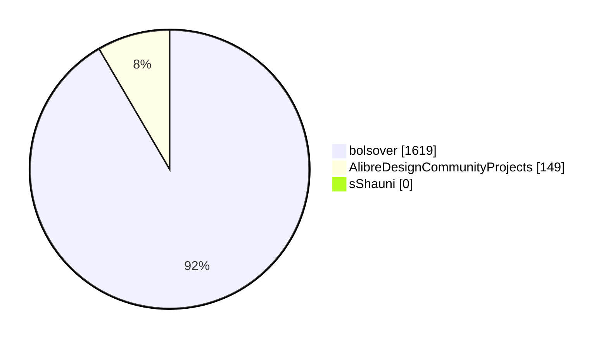

## Release Summary By Language

| Language | Repos | Releases | Assets | Total Downloads |
| --- | --- | --- | --- | --- |
| C# | 5 | 36 | 53 | 1650 |
| Python | 4 | 6 | 9 | 90 |
| C++ | 1 | 8 | 8 | 28 |

### Chart: By Release: Downloads by Language

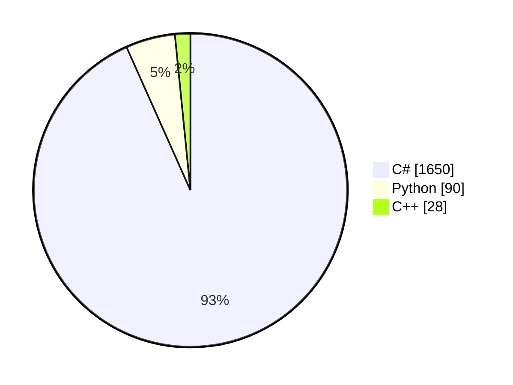

## Release Summary By Search Term

| Search Term | Repos | Releases | Assets | Total Downloads |
| --- | --- | --- | --- | --- |
| alibre | 10 | 50 | 70 | 1768 |
| "alibre script" | 1 | 3 | 5 | 31 |
| "alibre design" | 2 | 9 | 9 | 28 |
| alibrescript | 0 | 0 | 0 | 0 |
| "alibre api" | 0 | 0 | 0 | 0 |
| "alibrex api" | 0 | 0 | 0 | 0 |
| alibrex | 0 | 0 | 0 | 0 |

### Chart: By Release: Downloads by Search Term

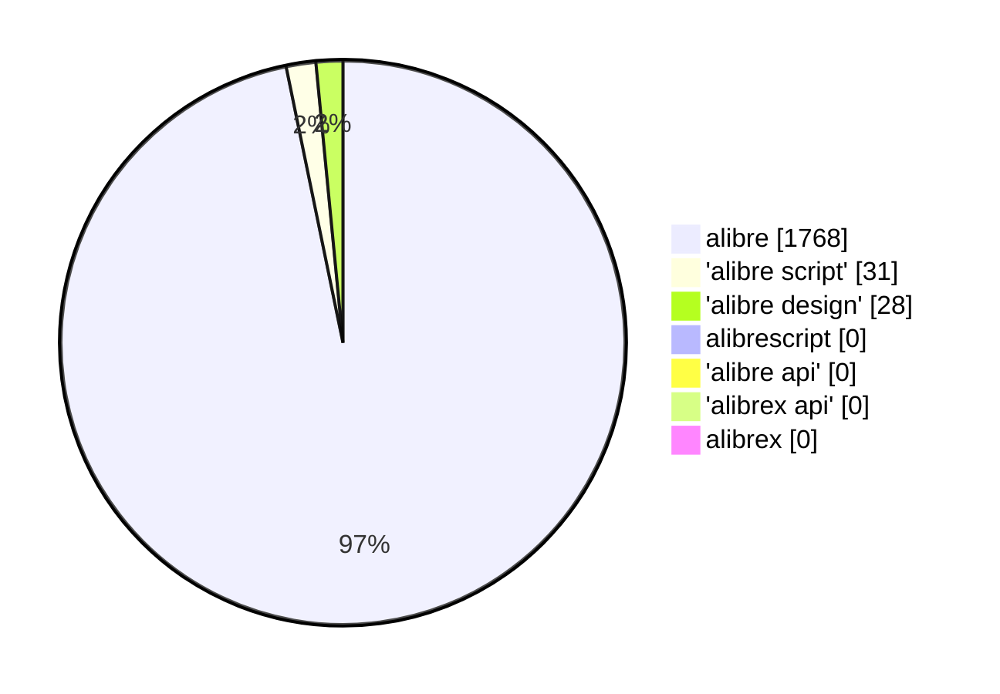

---

<h1>More breakdowns</h1>

# Search-Term Summary

## Executive Summary

- 59 unique repositories matched across 7 Alibre-related terms.
- 29 owners/orgs are represented.
- Aggregate social footprint is modest: 30 stars, 32 forks.
- Most results come from the base term `alibre`; phrase-level terms add classification depth.

## Core KPIs

| Metric | Value |
|---|---:|
| Repositories (union) | 59 |
| Owners/Orgs | 29 |
| Total Stars | 30 |
| Total Forks | 32 |
| Total Open Issues | 24 |
| Terms Queried | 7 |

## Term Coverage

| Term | Name/Description Matches |
|---|---:|
| alibre | 59 |
| "alibre design" | 14 |
| "alibre script" | 5 |
| alibrescript | 4 |
| alibrex | 3 |
| "alibrex api" | 1 |
| "alibre api" | 0 |

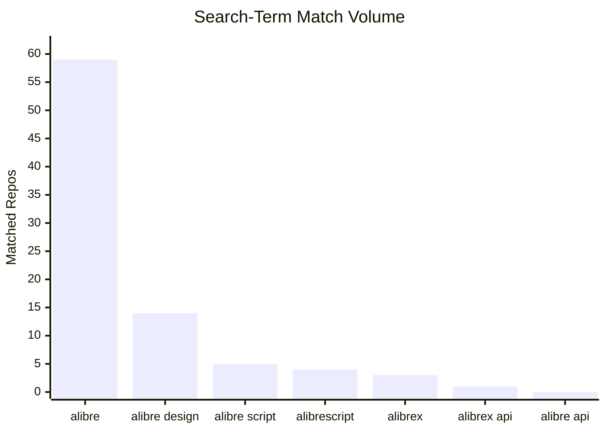

## Top Owners by Stars

| Owner | Repos | Stars |
|---|---:|---:|
| bolsover | 7 | 19 |
| AlibreDesignCommunityProjects | 22 | 4 |
| k4kfh | 1 | 2 |
| 100ideas | 1 | 1 |

## Language Mix (Top)

| Language | Repos |
|---|---:|
| Unspecified | 18 |
| Python | 14 |
| C# | 13 |
| C++ | 3 |
| Visual Basic .NET | 3 |

# Search-Term Detailed Report

Filter model: repository **name/description only** matching.

## 1) Search Term Performance

| Term | Quick Total (No Slice) | Matched by Name/Description | New Unique Repos | Newly Tagged Existing Repos |
|---|---:|---:|---:|---:|
| alibre | 60 | 59 | 59 | 0 |
| "alibre design" | 15 | 14 | 0 | 14 |
| "alibre script" | 9 | 5 | 0 | 5 |
| alibrescript | 4 | 4 | 0 | 4 |
| alibrex | 3 | 3 | 0 | 3 |
| "alibrex api" | 1 | 1 | 0 | 1 |
| "alibre api" | 0 | 0 | 0 | 0 |

## 2) Owner Concentration

| Rank | Owner | Repos | Stars | Forks |
|---:|---|---:|---:|---:|
| 1 | bolsover | 7 | 19 | 7 |
| 2 | AlibreDesignCommunityProjects | 22 | 4 | 20 |
| 3 | k4kfh | 1 | 2 | 2 |
| 4 | 100ideas | 1 | 1 | 0 |
| 5 | ajayre | 1 | 1 | 1 |
| 6 | Karl690 | 1 | 1 | 0 |
| 7 | KOCH-Engineering | 1 | 1 | 0 |
| 8 | Romain-Laine | 1 | 1 | 0 |

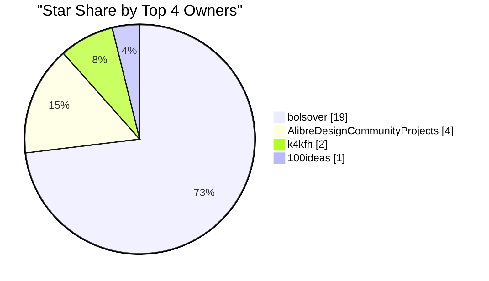

## 3) Top Repositories by Stars

| Rank | Repository | Stars | Forks | Language | Updated |
|---:|---|---:|---:|---|---|
| 1 | bolsover/UtilitiesForAlibre | 10 | 3 | C# | 2026-08-23T10:40:58Z |
| 2 | AlibreDesignCommunityProjects/alibre-stltostp-addon | 2 | 1 | C# | 2026-08-24T02:12:44Z |
| 3 | AlibreDesignCommunityProjects/AlibreScript | 2 | 1 | Python | 2026-07-27T10:50:16Z |
| 4 | bolsover/AlibreBOM | 2 | 0 | C# | 2025-07-09T13:50:16Z |
| 5 | bolsover/AlibreExportOpen | 2 | 1 | C# | 2026-07-30T02:30:18Z |
| 6 | bolsover/AlibreShortcuts | 2 | 1 | C# | 2025-07-09T13:50:09Z |
| 7 | bolsover/DataBrowserForAlibre | 2 | 1 | C# | 2025-07-09T13:50:14Z |
| 8 | k4kfh/alibre-neutralizer | 2 | 2 | Python | 2025-11-10T06:09:09Z |
| 9 | 100ideas/ucam-alibre-cad | 1 | 0 | Unspecified | 2016-03-17T22:42:32Z |
| 10 | ajayre/parametricbearings | 1 | 1 | Unspecified | 2025-11-10T06:10:08Z |

## 4) Language Distribution

| Language | Repo Count |
|---|---:|
| Unspecified | 18 |
| Python | 14 |
| C# | 13 |
| C++ | 3 |
| Visual Basic .NET | 3 |
| HTML | 2 |
| JavaScript | 1 |
| Jupyter Notebook | 1 |
| Kotlin | 1 |
| OpenSCAD | 1 |
| PHP | 1 |
| Terra | 1 |

## 5) Detailed Totals

| Metric | Value |
|---|---:|
| Total Repositories | 59 |
| Total Owners | 29 |
| Total Stars | 30 |
| Total Forks | 32 |
| Total Open Issues | 24 |

# Release Analytics Summary

## Executive Summary

- 1,770 total release downloads across 11 repositories.
- 51 release rows were captured.
- Download concentration is high in `bolsover/UtilitiesForAlibre` (1,270 downloads).

## Core KPIs

| Metric | Value |
|---|---:|
| Total Downloads | 1,770 |
| Repositories with Releases | 11 |
| Release Rows | 51 |
| Top Repo Downloads | 1,270 |

## Top Repositories by Downloads

| Repository | Total Downloads | Releases |
|---|---:|---:|
| bolsover/UtilitiesForAlibre | 1,270 | 17 |
| bolsover/AlibreShortcuts | 158 | 10 |
| bolsover/AlibreExportOpen | 120 | 2 |
| AlibreDesignCommunityProjects/alibre-sweep-tools-addon | 80 | 2 |
| bolsover/AlibreImportStlAsStep | 71 | 4 |
| AlibreDesignCommunityProjects/alibre-shapes-addon | 31 | 3 |

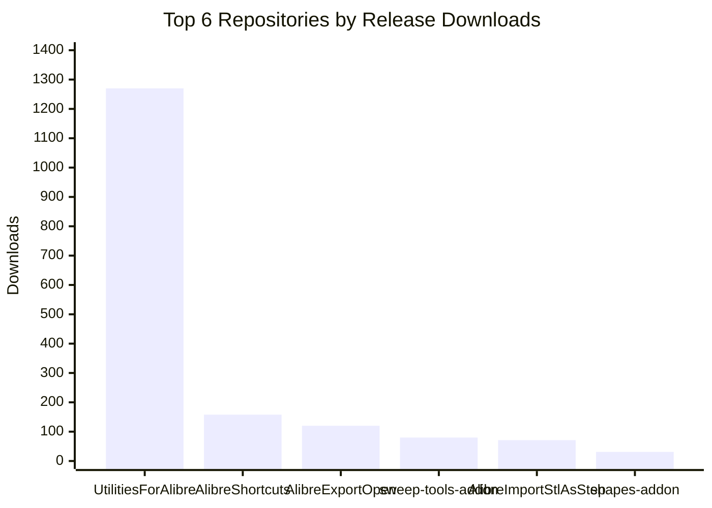

## Top Releases by Downloads

| Repository | Tag | Published | Downloads |
|---|---|---|---:|
| bolsover/UtilitiesForAlibre | V2.1.0.0 | 2024-03-18T21:24:33Z | 390 |
| bolsover/UtilitiesForAlibre | V3.0.0.0 | 2024-06-03T10:51:52Z | 214 |
| bolsover/UtilitiesForAlibre | V1.0.0.11 | 2022-06-09T18:23:29Z | 138 |
| bolsover/UtilitiesForAlibre | V3.1.0.0 | 2025-09-24T13:32:15Z | 127 |
| bolsover/AlibreExportOpen | V1.1 | 2022-11-08T15:01:00Z | 89 |

# Release Analytics Detailed Report

## 1) Portfolio Totals

| Metric | Value |
|---|---:|
| Total Downloads | 1,770 |
| Repositories with Release Data | 11 |
| Release Records | 51 |

## 2) Repository Download Ranking

| Rank | Repository | Total Downloads | Releases |
|---:|---|---:|---:|
| 1 | bolsover/UtilitiesForAlibre | 1,270 | 17 |
| 2 | bolsover/AlibreShortcuts | 158 | 10 |
| 3 | bolsover/AlibreExportOpen | 120 | 2 |
| 4 | AlibreDesignCommunityProjects/alibre-sweep-tools-addon | 80 | 2 |
| 5 | bolsover/AlibreImportStlAsStep | 71 | 4 |
| 6 | AlibreDesignCommunityProjects/alibre-shapes-addon | 31 | 3 |
| 7 | AlibreDesignCommunityProjects/MeasureLengths | 28 | 8 |
| 8 | AlibreDesignCommunityProjects/alibre-cross-section-tools-addon | 10 | 2 |
| 9 | AlibreDesignCommunityProjects/TableTo3DPoints | 2 | 1 |

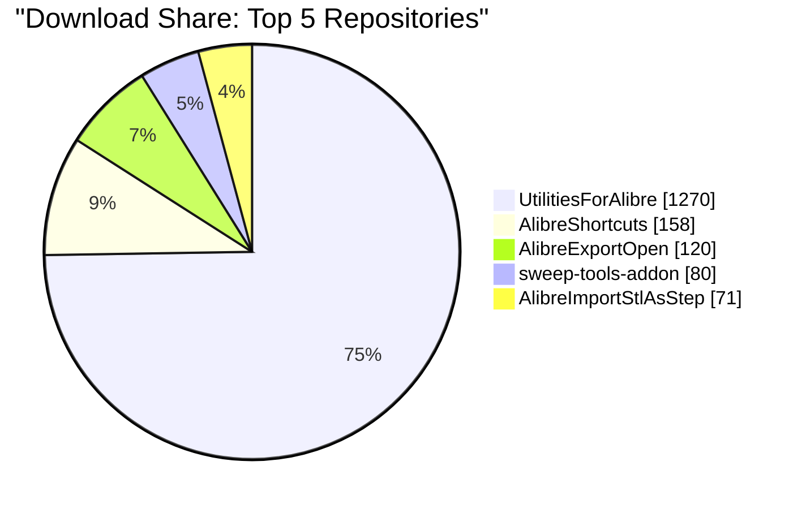

## 3) Top Releases by Download Count

| Rank | Repository | Tag | PublishedAt | Downloads |
|---:|---|---|---|---:|
| 1 | bolsover/UtilitiesForAlibre | V2.1.0.0 | 2024-03-18T21:24:33Z | 390 |
| 2 | bolsover/UtilitiesForAlibre | V3.0.0.0 | 2024-06-03T10:51:52Z | 214 |
| 3 | bolsover/UtilitiesForAlibre | V1.0.0.11 | 2022-06-09T18:23:29Z | 138 |
| 4 | bolsover/UtilitiesForAlibre | V3.1.0.0 | 2025-09-24T13:32:15Z | 127 |
| 5 | bolsover/AlibreExportOpen | V1.1 | 2022-11-08T15:01:00Z | 89 |
| 6 | bolsover/UtilitiesForAlibre | V1.3.0.0 | 2022-11-04T16:43:51Z | 84 |
| 7 | bolsover/AlibreShortcuts | V3.1 | 2023-11-23T14:24:56Z | 73 |
| 8 | bolsover/AlibreImportStlAsStep | V1.3 | 2025-11-06T14:37:53Z | 51 |
| 9 | AlibreDesignCommunityProjects/alibre-sweep-tools-addon | poc-r1 | 2025-08-26T05:06:21Z | 49 |
| 10 | bolsover/UtilitiesForAlibre | V1.1.0.1 | 2022-09-01T16:14:54Z | 46 |
| 11 | bolsover/UtilitiesForAlibre | V1.0.0.10 | 2022-06-08T11:46:46Z | 40 |
| 12 | bolsover/UtilitiesForAlibre | V1.1.0.0 | 2022-08-25T15:26:11Z | 33 |
| 13 | AlibreDesignCommunityProjects/alibre-sweep-tools-addon | poc-r1.1 | 2025-09-01T13:34:58Z | 31 |
| 14 | bolsover/AlibreExportOpen | V1.0 | 2022-11-01T21:16:30Z | 31 |
| 15 | bolsover/UtilitiesForAlibre | V1.4.0.0 | 2024-02-08T20:14:06Z | 31 |

## 4) Concentration Notes

- The top repository contributes 71.8% of total downloads (1,270 / 1,770).
- The top 4 repositories contribute 92.0% of total downloads (1,628 / 1,770).
- Distribution suggests strong concentration in a small set of repositories.
